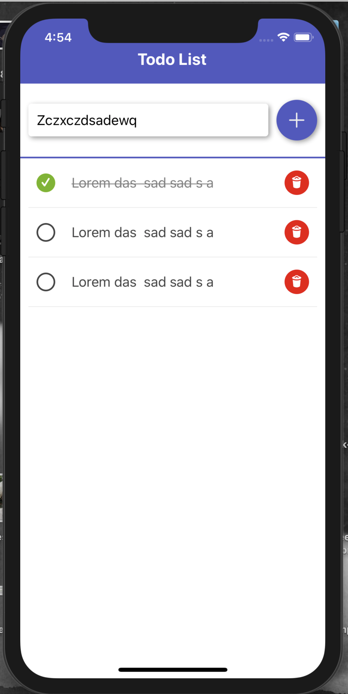

## Task 6 summary - Todo list

Your task is to create the todo list using React-native;

- You have to init your project ( check https://facebook.github.io/react-native/docs/getting-started.html `Building Projects with Native Code` section);
- You don't have to use any navigation in the app so it can be the simple App.js components that contain all your app;
- It's `not` required to use `Redux`, you should simply use `state` to write logic related to your todos
- You must have the ability to `create`, `complete` and `delete` todos;
- Your app must be separated into logical components like `<CreateTodo />`, `<TodosList />` ...

Example how it could be, you can style it on your own

----------------